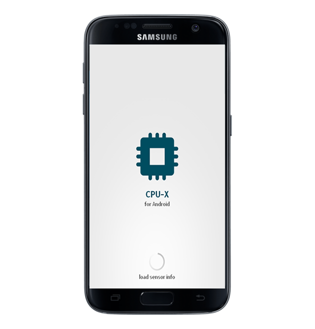
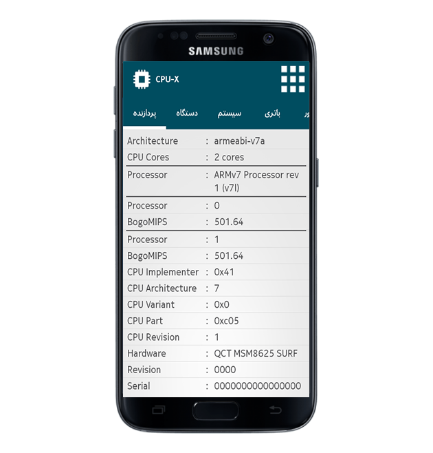
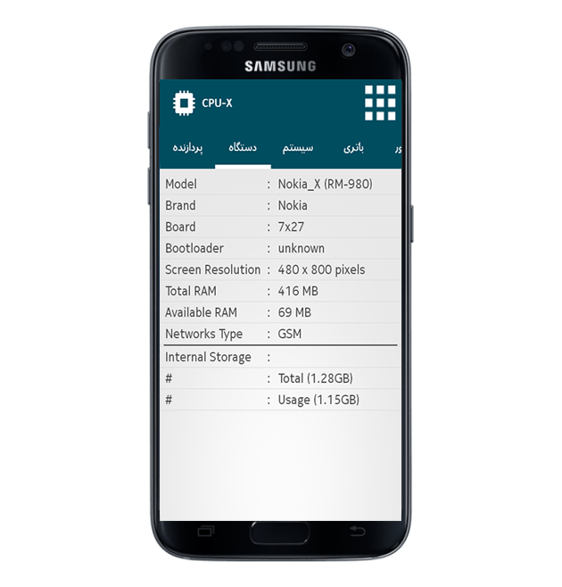
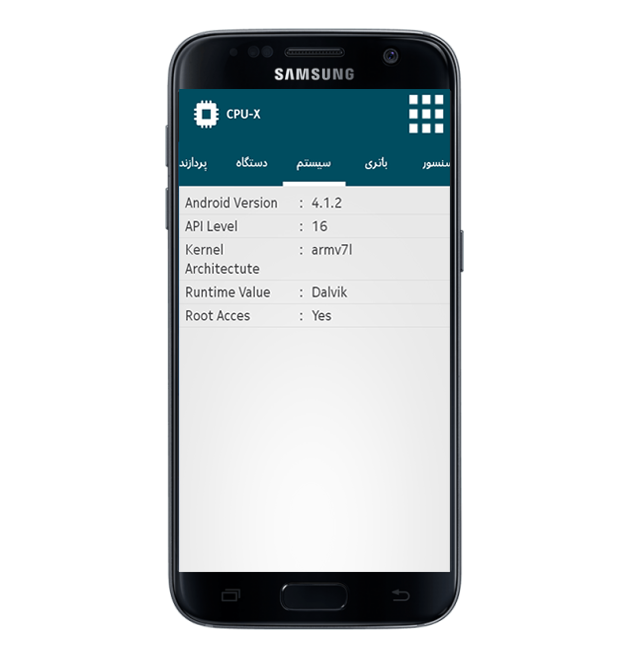
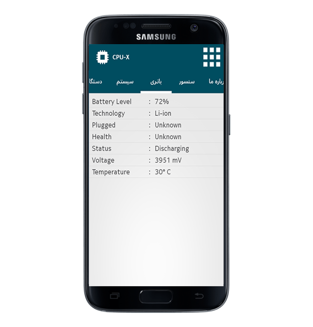
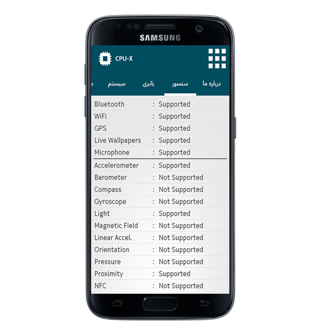

# CPU-X 📱

CPU-X is an Android app that displays detailed device information in a simple, tabbed UI. It groups hardware, system, battery, and sensor data so users can quickly inspect their phone's specs and status.

## Features ✨
- 🧠 CPU details (architecture, cores, raw `/proc/cpuinfo`)
- 📦 Device information (model, brand, board, bootloader)
- 🖥️ Screen, RAM, and storage stats (internal/external)
- ⚙️ System info (Android version, API level, runtime, root state)
- 🔋 Battery health and status (level, temperature, voltage)
- 🧭 Sensor and hardware support (GPS, NFC, accelerometer, etc.)
- 🧩 Tabbed navigation for fast switching between sections

## What the app shows ✅

| Section | What it shows | Notes |
| --- | --- | --- |
| CPU | Architecture, core count, `/proc/cpuinfo` | Low-level CPU data |
| Device | Model, brand, board, screen resolution | Includes storage and RAM |
| System | Android version, API level, kernel arch, runtime | Root detection included |
| Battery | Level, health, status, temp, voltage | Uses system battery broadcast |
| Sensors | Hardware support list (GPS, NFC, gyro, etc.) | Based on device capabilities |

## Screenshots 🖼️

## Tech stack 🛠️
- Android (Java)
- Android Support Libraries
- Glide (image loading)
- BottomSheet UI
- Local JARs (mail, volley)

## Project structure 🗂️
- `app/src/main/java/com/cpux` — core activities and fragments
- `app/src/main/java/com/cpux/tools` — data loaders and utilities
- `app/src/main/res` — layouts, drawables, strings, styles

## Permissions 🔐
The app uses:
- `INTERNET`
- `ACCESS_NETWORK_STATE`
- `CHANGE_WIFI_STATE`
- `CHANGE_WIFI_MULTICAST_STATE`

## Build & run 🚀
1. Open the project in Android Studio.
2. Let Gradle sync dependencies.
3. Run on an emulator or a device (minSdk 15, targetSdk 24).

## Notes 📌
- Some UI strings are in Persian.
- The app includes a contact/share screen implemented via email.
